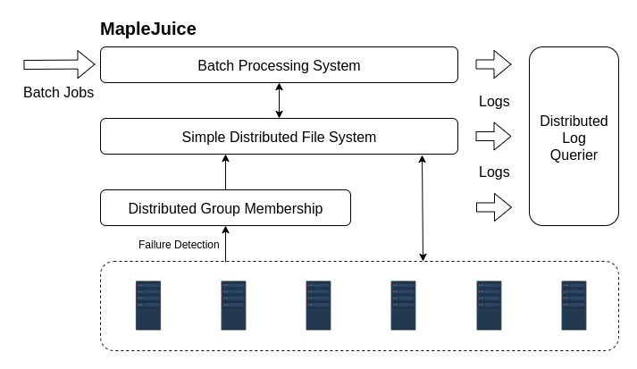

# MapleJuice

MapleJuice is a batch processing system that works like MapReduce.

## Overview



For detailed design of MapleJuice's components, see:

- [MapleJuice](maplejuice/README.md)
- [Simple Distributed File System](filesystem/README.md)
- [Distributed Group Membership Service](membership/README.md)
- [Distributed Log Querier](log_querier.README.md)

You can also check out our [report](Report.pdf).

## Requirement

The code is developed and tested with Go v1.13. The only third party library used is [emirpasic/gods v1.12.0](https://github.com/emirpasic/gods/releases/tag/v1.12.0) for treemap.

## Usage

### Run

```bash
go run main.go <port_number>
```

This will print log in a log file (vm.log). To print log to screen, use

```bash
go run main.go <port_number> --log2screen
```

Port numbers 1234, 1235 and 1236 are pre-occupied by and hence not allowed to be used.

A list of potential introducer's addresses should be provided in the file _introducer.config_.

We also implemented a distributed log querier for debugging. You can check it out [here](logquerier).

You are then able to input commands to the terminal.

### Group Membership

An introducer needs to be started first by entering

```text
introducer
join
```

Other nodes can join subsequently by entering

```text
join
```

After joining the group, the following commands are avaiable:

```text
leave: leave the group

ml: print current node's membership list

id: print current node's id
```

The membership list includes a list of member ids, the member id is the concatenation of the member's IP address, port number, and join time in string format.

### Distributed File System

A node joins the DFS service as soon as it joins the group. The following commands are supported:

```text
put <localfilename> <sdfsfilename>: put localfilename on local FS to sdfefilename on SDFS

get <sdfsfilename> <localfilename>: get sdfsfilename on SDFS to localfilename on local FS

delete <sdfsfilename>: delete sdfefilename on SDFS

ls <sdfsfilename>: list the storing nodes of all replicas of sdfefilename

store: list the SDFS files stored on the current node
```

### MapleJuice

To start the MapleJuice service, you first need to let nodes join the group, and then select a node as the master node by entering

```text
master
```

and others as the worker node by entering

```text
worker
```

MapleJuice is invoked via two command lines. Overall a MapleJuice job takes as input a corpus of SDFS files and outputs a single SDFS file. At most one job can be processed at the same time, but multiple jobs can be submitted and queued meanwhile. Two example of applications (wordcount, URL access percentage) can be found [here](applications).

#### Maple

```text
maple <maple_exe> <num_maples>
<sdfs_intermediate_filename_prefix> <sdfs_src_files>
```

The first parameter _maple_exe_ is a user-specified executable that takes as input one file and outputs a series of (key, value) pairs. _maple_exe_ is the SDFS file name. The second parameter _num_maples_ specifies the number of Maple tasks. The last series of parameters (_sdfs_src_files_) specifies the location of the input files.

The output of the Maple phase (not task) is a series of SDFS files, one per key. That is, for a key K, all (K, any_value) pairs output by any Maple task must be appended to the file _sdfs_intermediate_filename_prefix_K_. After the Juice phase is done, you will have the option to delete these intermediate files.

#### Juice

```text
juice <juice_exe> <num_juices>
<sdfs_intermediate_filename_prefix> <sdfs_dest_filename>
<delete_input={0,1}> [partitioner={range, hash}](optional, default=range)
```

The first parameter _juice_exe_ is a user-specified executable that takes as input multiple (key, value) input lines, processes groups of (key, any_values) input lines together (sharing the same key, just like Reduce), and outputs (key, value) pairs. _juice_exe_ is the SDFS file name. The second parameter _num_juices_ specifies the number of Juice tasks.

Each juice task is responsible for a portion of the keys – each key is allotted to exactly one Juice task (this is done by the Master server). The juice task fetches the relevant SDFS files _sdfs_intermediate_filename_prefix_K_’s, processes the input lines in them, and appends all its output to _sdfs_dest_filename_ sorted by key.

When the last parameter _delete_input_ is set to 1, the MapleJuice engine deletes the input files automatically after the Juice phase is done. If _delete_input_ is set to 0, the Juice input files is left untouched.

## Developers

- [Zhanghao Chen](mailto:zc32@illinois.edu)
- [Zijie Lu](mailto:zijielu2@illinois.edu)
